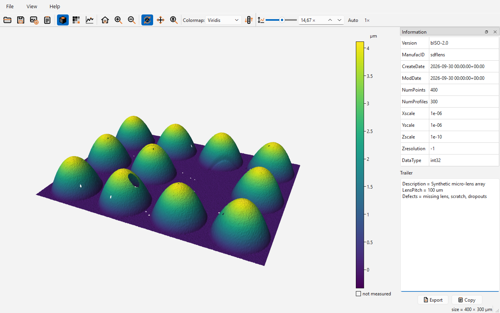

# sdflens

[](https://github.com/aschet/sdflens/actions/workflows/ci.yml)

Qt based 3D, 2D and profile viewer for ISO 25178-71 Surface Data Files (`.sdf`) and ISO 25178-72
x3p files (`.x3p`), built on [sdfio](https://github.com/aschet/sdfio),
[x3pio](https://github.com/aschet/x3pio) and PySide6.



## Features

- Opens ISO 25178-71 SDF and ISO 25178-72 x3p files.
- 3D, 2D and profile views.
- Selectable, reversible colormaps with a color bar; non-measured points are left empty.
- Shows and exports the metadata; vendor extensions of x3p files can be saved.
- Saves files as SDF or x3p, with conversion between the formats.
- Screenshots as PNG file or on the clipboard.

Try it with the sample [samples/microlens-array.sdf](samples/microlens-array.sdf).

## Build and Run

Windows (PowerShell):

```powershell
python -m venv .venv
.venv\Scripts\activate
pip install .
sdflens
```

Linux and macOS:

```sh
python3 -m venv .venv
source .venv/bin/activate
pip install .
sdflens
```

`python -m sdflens` starts the viewer as well.

Until x3pio is released on PyPI, it is installed from its git repository, so
[git](https://git-scm.com/) has to be installed.

## Windows Installer

With the virtual environment activated and the [.NET SDK](https://dotnet.microsoft.com/download)
installed, this builds a standalone app and the [WiX](https://wixtoolset.org/) installer
`build\installer\sdflens-<version>.msi`, next to a [CycloneDX](https://cyclonedx.org/) SBOM of the
runtime dependencies, `build\installer\sdflens-<version>.cdx.json`:

```powershell
.\packaging\build_windows.ps1
```

The build installs exactly the package versions listed in `pylock.build.toml`. The uv command that updates them is at the top of `packaging\build_windows.ps1`.

Until x3pio is released on PyPI, the script installs it separately from its git repository, at a
commit that it names, because pip cannot install a git dependency together with hashes.

## Linux AppImage

On Linux, this builds a standalone app and, if [appimagetool](https://github.com/AppImage/appimagetool)
is in the `PATH` or named by `APPIMAGETOOL`, the AppImage `build/appimage/sdflens-<version>-<arch>.AppImage`:

```sh
./packaging/build_linux.sh
```

Build it on the oldest distribution that should run it, since an AppImage needs the glibc of the
system it was built on or newer. The workflow in `.github/workflows/build.yml` does that for the
releases.
